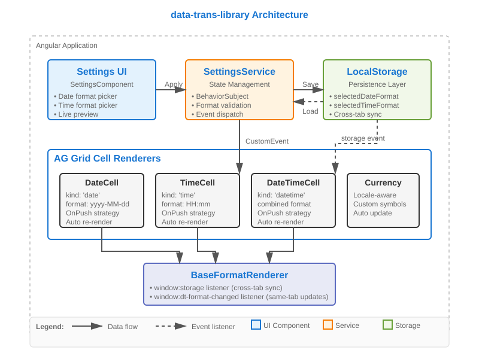
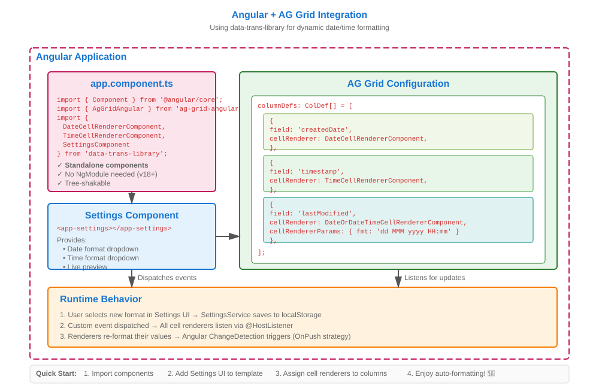

# 📅 data-trans-library

**Production-ready Angular date/time formatting for AG Grid with live, user-configurable formats**

[](https://www.npmjs.com/package/data-trans-library)
[](https://opensource.org/licenses/MIT)
[](https://angular.io/)
[](https://www.ag-grid.com/)

---

## 🎯 Problem

Enterprise applications often need to display dates and times in different formats based on:
- **User preferences** (US vs EU date formats, 12h vs 24h time)
- **Regional standards** (different locales, calendars like Hijri)
- **Business requirements** (specific column formats)

Traditional solutions require:
- ❌ Hard-coding formats in every cell renderer
- ❌ Manual grid refresh when settings change
- ❌ Complex state management across components
- ❌ Rebuilding the app for different markets

**data-trans-library** solves this with **zero-config reactive formatting** that:
- ✅ Updates all cells instantly when user changes format
- ✅ Persists preferences across sessions
- ✅ Syncs format changes across browser tabs
- ✅ Works seamlessly with AG Grid's virtual scrolling
- ✅ Supports multiple calendar systems (Gregorian, Hijri)

---

## ✨ Features

- 🔄 **Reactive Formatting** - Cell renderers auto-update when formats change (no manual refresh)
- 💾 **Persistent Settings** - User preferences saved to localStorage
- 🌐 **Cross-Tab Sync** - Format changes propagate to all browser tabs instantly
- 🎨 **Settings UI** - Drop-in component with live preview
- ⚡ **Optimized Performance** - OnPush change detection, no unnecessary re-renders
- 📅 **Multiple Calendars** - Hijri calendar support with moment-hijri
- 💰 **Currency Formatting** - Locale-aware currency display
- 🔧 **Column Overrides** - Per-column format customization
- 🌍 **Timezone Support** - Display dates in any timezone
- 🎯 **Type-Safe** - Full TypeScript support
- 📦 **Tree-Shakable** - Standalone components, import only what you need
- 🧪 **Well-Tested** - Comprehensive test coverage

---

## 📦 Installation

```bash
npm install data-trans-library
```

### Peer Dependencies

Ensure you have the following installed:

```json
{
  "@angular/common": "^18.0.0 || ^19.0.0 || ^20.0.0",
  "@angular/core": "^18.0.0 || ^19.0.0 || ^20.0.0",
  "@angular/material": "^18.0.0",
  "ag-grid-angular": "^31.0.0 || ^32.0.0",
  "ag-grid-community": "^31.0.0 || ^32.0.0",
  "rxjs": "^7.0.0"
}
```

**Optional** (for additional features):
- `moment`: ^2.30.0 - For advanced date manipulation
- `moment-hijri`: ^2.30.0 - For Hijri calendar support
- `primeng`: ^17.0.0 - For PrimeNG integration
- `@syncfusion/ej2-angular-calendars`: ^31.0.0 - For Syncfusion calendar widgets

---

## 🚀 Quick Start

### 1. Import Components

```typescript
// app.component.ts
import { Component } from '@angular/core';
import { AgGridAngular } from 'ag-grid-angular';
import { ColDef } from 'ag-grid-community';
import {
  DateCellRendererComponent,
  TimeCellRendererComponent,
  DateOrDateTimeCellRendererComponent,
  SettingsComponent
} from 'data-trans-library';

@Component({
  selector: 'app-root',
  standalone: true,
  imports: [
    AgGridAngular,
    DateCellRendererComponent,
    TimeCellRendererComponent,
    SettingsComponent
  ],
  template: `
    <!-- Settings UI -->
    <app-settings></app-settings>
    
    <!-- Your AG Grid -->
    <ag-grid-angular
      [rowData]="rowData"
      [columnDefs]="columnDefs"
      class="ag-theme-alpine"
      style="height: 500px;">
    </ag-grid-angular>
  `
})
export class AppComponent {
  rowData = [
    {
      createdDate: '2024-01-15',
      timestamp: 1705305600000,
      lastModified: '2024-01-15T14:30:00Z'
    }
  ];

  columnDefs: ColDef[] = [
    {
      field: 'createdDate',
      headerName: 'Created',
      cellRenderer: DateCellRendererComponent
    },
    {
      field: 'timestamp',
      headerName: 'Time',
      cellRenderer: TimeCellRendererComponent
    },
    {
      field: 'lastModified',
      headerName: 'Last Modified',
      cellRenderer: DateOrDateTimeCellRendererComponent
    }
  ];
}
```

### 2. Use with NgModule (Angular < 14)

```typescript
import { NgModule } from '@angular/core';
import { SettingsModule } from 'data-trans-library';

@NgModule({
  imports: [SettingsModule],
  // ...
})
export class AppModule {}
```

### 3. That's it! 🎉

Users can now change date/time formats via the Settings UI, and all cells update automatically.

---

## 📖 Usage Examples

### Basic Date Formatting

```typescript
columnDefs: ColDef[] = [
  {
    field: 'birthDate',
    cellRenderer: DateCellRendererComponent
    // Uses user's selected format from Settings UI
    // Default: 'yyyy-MM-dd'
  }
];
```

### Custom Format Override

```typescript
{
  field: 'eventDate',
  cellRenderer: DateCellRendererComponent,
  cellRendererParams: {
    fmt: 'dd MMM yyyy'  // Always displays as "15 Jan 2024"
  }
}
```

### DateTime with Timezone

```typescript
{
  field: 'scheduledAt',
  cellRenderer: DateOrDateTimeCellRendererComponent,
  cellRendererParams: {
    fmt: 'yyyy-MM-dd HH:mm',
    timezone: 'America/New_York'  // or 'UTC', 'Asia/Dubai', etc.
  }
}
```

### Legacy Format Support

```typescript
{
  field: 'date',
  cellRenderer: DateCellRendererComponent,
  cellRendererParams: {
    dateFormat: 'MM/dd/yyyy',  // Still supported
    // or dateFmt: 'MM/dd/yyyy'
  }
}
```

### Time-Only Formatting

```typescript
{
  field: 'clockIn',
  cellRenderer: TimeCellRendererComponent,
  cellRendererParams: {
    fmt: 'hh:mm a'  // 12-hour format with AM/PM
  }
}
```

### Currency Formatting

```typescript
import { CurrencyCellRendererComponent } from 'data-trans-library';

{
  field: 'price',
  cellRenderer: CurrencyCellRendererComponent,
  cellRendererParams: {
    currencyCode: 'USD',
    locale: 'en-US'
  }
}
```

### Hijri Calendar

```typescript
import { HijriDateFieldComponent } from 'data-trans-library';

// In your template
<hijri-date-field
  [(ngModel)]="selectedDate"
  [format]="'iYYYY/iMM/iDD'">
</hijri-date-field>
```

---

## ⚙️ Configuration

### Available Date Formats

The Settings UI provides these date formats out of the box:

| Format | Example Output |
|--------|----------------|
| `yyyy-MM-dd` | 2024-01-15 |
| `dd/MM/yyyy` | 15/01/2024 |
| `MM/dd/yyyy` | 01/15/2024 |
| `yyyy/MM/dd` | 2024/01/15 |
| `dd-MM-yyyy` | 15-01-2024 |
| `MM-dd-yyyy` | 01-15-2024 |
| `dd MMM yyyy` | 15 Jan 2024 |
| `MMM dd, yyyy` | Jan 15, 2024 |

### Available Time Formats

| Format | Example Output |
|--------|----------------|
| `HH:mm:ss` | 14:30:00 |
| `HH:mm` | 14:30 |
| `hh:mm:ss a` | 02:30:00 PM |
| `hh:mm a` | 02:30 PM |

### Programmatic Access

```typescript
import { SettingsService } from 'data-trans-library';

@Component({...})
export class MyComponent {
  constructor(private settings: SettingsService) {}

  updateFormats() {
    // Get current formats
    const dateFormat = this.settings.getDateFormat();
    const timeFormat = this.settings.getDateTimeFormat();

    // Set new formats
    this.settings.setDateFormat('dd/MM/yyyy');
    this.settings.setDateTimeFormat('HH:mm:ss');
  }
}
```

### Column Renderer Parameters

All cell renderers accept these parameters:

```typescript
interface BaseFormatParams {
  /** Single combined format (highest priority) */
  fmt?: string;

  /** Date format override */
  dateFormat?: string;
  dateFmt?: string;  // Alias

  /** Time format override */
  timeFormat?: string;
  timeFmt?: string;  // Alias

  /** Timezone (e.g., 'UTC', 'America/New_York', or null for local) */
  timezone?: string | null;
  tz?: string;  // Alias
}
```

**Priority Order** (highest to lowest):
1. `cellRendererParams.fmt`
2. `cellRendererParams.dateFormat` / `timeFormat`
3. User's settings (localStorage)
4. Default values

---

## 🏗️ Architecture

### High-Level Overview



**Components:**
- **SettingsComponent** - UI for format selection with live preview
- **SettingsService** - Centralized state management with localStorage persistence
- **Cell Renderers** - Reactive AG Grid components that auto-update on format changes
- **BaseFormatRenderer** - Base class handling event listeners and format resolution

### Data Flow


**Flow Steps:**
1. **Input**: Raw cell value (string, number, Date object)
2. **Resolution**: Determine format (params → localStorage → defaults)
3. **Parsing**: Convert value to Date object
4. **Formatting**: Apply format using Angular DatePipe
5. **Output**: Rendered string in grid cell
6. **Updates**: Listen for format changes and re-render

### Event System

The library uses two event mechanisms for reactive updates:

1. **`window:storage`** - Native browser event for cross-tab synchronization
2. **`window:dt-format-changed`** - Custom event for same-tab instant updates

Both are handled automatically by `BaseFormatRenderer` via `@HostListener`.

---

## 🔌 Integration Guide

### Angular + AG Grid Integration



### Step-by-Step Integration

#### 1. Install Dependencies

```bash
npm install data-trans-library ag-grid-angular ag-grid-community
```

#### 2. Import Styles (ag-grid theme)

```scss
// styles.scss
@import 'ag-grid-community/styles/ag-grid.css';
@import 'ag-grid-community/styles/ag-theme-alpine.css';
```

#### 3. Configure Your Grid

```typescript
import { Component } from '@angular/core';
import { ColDef } from 'ag-grid-community';
import { DateCellRendererComponent } from 'data-trans-library';

@Component({
  selector: 'app-data-grid',
  template: `
    <ag-grid-angular
      class="ag-theme-alpine"
      [rowData]="rowData"
      [columnDefs]="columnDefs"
      [defaultColDef]="defaultColDef"
      style="width: 100%; height: 600px;">
    </ag-grid-angular>
  `
})
export class DataGridComponent {
  columnDefs: ColDef[] = [
    {
      field: 'id',
      headerName: 'ID',
      width: 80
    },
    {
      field: 'createdAt',
      headerName: 'Created',
      cellRenderer: DateCellRendererComponent,
      width: 150
    },
    {
      field: 'modifiedAt',
      headerName: 'Modified',
      cellRenderer: DateOrDateTimeCellRendererComponent,
      cellRendererParams: {
        fmt: 'dd/MM/yyyy HH:mm'
      },
      width: 180
    }
  ];

  defaultColDef: ColDef = {
    sortable: true,
    filter: true,
    resizable: true
  };

  rowData = [
    {
      id: 1,
      createdAt: '2024-01-15',
      modifiedAt: '2024-01-15T14:30:00Z'
    }
  ];
}
```

#### 4. Add Settings UI (Optional)

```typescript
// app.component.ts
import { SettingsComponent } from 'data-trans-library';

@Component({
  selector: 'app-root',
  standalone: true,
  imports: [SettingsComponent, DataGridComponent],
  template: `
    <header>
      <h1>My Application</h1>
      <app-settings></app-settings>
    </header>
    <main>
      <app-data-grid></app-data-grid>
    </main>
  `
})
export class AppComponent {}
```

---

## 🧪 Testing

The library includes comprehensive tests. Run them with:

```bash
# Unit tests
ng test grid-formatters

# Build the library
ng build grid-formatters

# Lint
ng lint grid-formatters
```

### Testing Your Implementation

```typescript
import { TestBed } from '@angular/core/testing';
import { SettingsService } from 'data-trans-library';

describe('Date Formatting', () => {
  it('should use user-selected format', () => {
    const service = TestBed.inject(SettingsService);
    service.setDateFormat('dd/MM/yyyy');
    expect(service.getDateFormat()).toBe('dd/MM/yyyy');
  });
});
```

---

## 📚 API Reference

### Components

#### `DateCellRendererComponent`
Renders date-only values.

**Kind:** `'date'`  
**Default Format:** `'yyyy-MM-dd'`

#### `TimeCellRendererComponent`
Renders time-only values.

**Kind:** `'time'`  
**Default Format:** `'HH:mm'`

#### `DateOrDateTimeCellRendererComponent`
Renders combined date and time.

**Kind:** `'datetime'`  
**Default Format:** `'yyyy-MM-dd HH:mm'`

#### `CurrencyCellRendererComponent`
Renders currency values with locale support.

**Parameters:**
- `currencyCode`: Currency code (e.g., 'USD', 'EUR')
- `locale`: Locale string (e.g., 'en-US', 'de-DE')

#### `SettingsComponent`
Standalone UI component for format selection.

**Features:**
- Date format dropdown
- Time format dropdown
- Live preview
- Apply button

### Services

#### `SettingsService`

```typescript
class SettingsService {
  // Available formats
  dateFormats: string[];
  dateTimeFormats: string[];

  // Getters
  getDateFormat(): string;
  getDateTimeFormat(): string;

  // Setters (validates and persists to localStorage)
  setDateFormat(format: string): void;
  setDateTimeFormat(format: string): void;
}
```

### Types

```typescript
// Format kind
type FormatKind = 'date' | 'time' | 'datetime';

// Cell renderer parameters
interface BaseFormatParams<TData = any> extends ICellRendererParams<TData> {
  fmt?: string;
  dateFormat?: string;
  dateFmt?: string;
  timeFormat?: string;
  timeFmt?: string;
  timezone?: string | null;
  tz?: string;
}
```

---

## 🗺️ Roadmap

### Coming Soon

- 🌍 **Extended Locale Support** - More pre-configured date/time formats for different regions
- 📱 **Mobile-Optimized Settings UI** - Touch-friendly format picker
- 🎨 **Theming Support** - Customizable Settings component styling
- 📊 **More Cell Renderers** - Percentage, Boolean, Custom icons
- 🔄 **RxJS Observables** - Reactive format change streams for advanced use cases
- 🌐 **i18n Integration** - Angular i18n/l10n support
- 📝 **Custom Format Validator** - User-defined format patterns
- ⚡ **Performance Metrics** - Built-in performance monitoring
- 🎯 **AG Grid v33+ Support** - Compatibility with upcoming AG Grid versions
- 📦 **Ivy Compiler Optimizations** - Smaller bundle sizes

### Future Considerations

- PrimeNG DataTable integration
- Support for other grid libraries (Kendo, Syncfusion)
- Format templates (presets for common use cases)
- User-defined format storage (custom formats)
- Export functionality (maintain formats in exports)

---

## 🤝 Contributing

Contributions are welcome! Please:

1. Fork the repository
2. Create a feature branch (`git checkout -b feature/amazing-feature`)
3. Commit your changes (`git commit -m 'Add amazing feature'`)
4. Push to the branch (`git push origin feature/amazing-feature`)
5. Open a Pull Request

### Development Setup

```bash
# Clone the repo
git clone https://github.com/AlyaariHazem/my-workspace.git
cd my-workspace

# Install dependencies
npm install

# Build the library
ng build grid-formatters

# Run tests
ng test grid-formatters

# Watch mode for development
ng build grid-formatters --watch
```

---

## 📄 License

This project is licensed under the MIT License - see the LICENSE file for details.

---

## 🙏 Acknowledgments

- **Angular Team** - For the amazing framework
- **AG Grid** - For the best data grid in the ecosystem
- **moment.js & moment-hijri** - For date manipulation and Hijri calendar support
- **Community Contributors** - Thank you for your feedback and contributions!

---

## 📞 Support

- 🐛 **Issues**: [GitHub Issues](https://github.com/AlyaariHazem/my-workspace/issues)
- 💬 **Discussions**: [GitHub Discussions](https://github.com/AlyaariHazem/my-workspace/discussions)
- 📧 **Email**: [Your contact email]
- 📖 **Documentation**: [Full Docs](https://github.com/AlyaariHazem/my-workspace/tree/main/projects/grid-formatters)

---

## 🌟 Show Your Support

If this library helped you, please give it a ⭐️ on [GitHub](https://github.com/AlyaariHazem/my-workspace)!

---

**Made with ❤️ for the Angular community**
